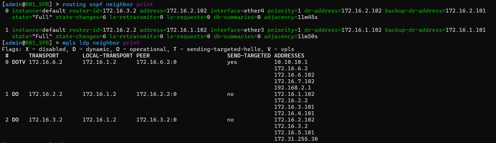

# Отчет по лабораторной работе №3

## Университет
* **University:** [ITMO University](https://itmo.ru/ru/)
* **Faculty:** [FICT](https://fict.itmo.ru)
* **Course:** [Introduction in routing](https://github.com/itmo-ict-faculty/introduction-in-routing)
* **Year:** 2024/2025
* **Group:** K3321
* **Author:** Babayev Ruslan Sagibovich
* **Lab:** Lab3
* **Date of create:** 30.10.2023
* **Date of finished:** 03.11.2023

## Задание

Вам необходимо сделать IP/MPLS сеть связи для "RogaIKopita Games" в ContainerLab. Необходимо создать все устройства, указанные на схеме и соединения между ними.

* Помимо этого вам необходимо настроить IP адреса на интерфейсах.
* Настроить OSPF и MPLS.
* Настроить EoMPLS.
* Назначить адресацию на контейнеры, связанные между собой EoMPLS.
* Настроить имена устройств, сменить логины и пароли.


## Описание работы

Для выполнения работы была арендована виртуальная машина в Selectel. На неё были установлены `docker`, `make` и `containerlab`, а также склонирован репозиторий `hellt/vrnetlab` (в папку routeros был загружен файл chr-6.47.9.vmdk). C помощью `make docker-image` был собран соответствуший образ.

### Топология 

Топология сети для компании "RogaIKopita Games" организована для связи офисов в разных городах (Санкт-Петербург, Хельсинки, Москва, Лондон, Лиссабон и Нью-Йорк) с использованием маршрутизаторов MikroTik, объединённых через OSPF и MPLS. Основной целью сети является обеспечение возможности передачи данных между двумя конкретными устройствами — сервером `SGI Prism` (Нью-Йорк) и `PC1` (Санкт-Петербург) — для доступа к наработкам в области компьютерной графики. В основе организации сети лежит использование EoMPLS, что позволяет установить туннель второго уровня между этими устройствами, делая их частью одной и той же виртуальной локальной сети (L2VPN) поверх IP/MPLS инфраструктуры.

Сеть состоит из шести маршрутизаторов, каждый из которых закреплён за одним из городов и подключён к остальным через Ethernet-соединения, а также двух компьютеров на базе Linux.
```
name: lab3

topology:
    kinds:
        vr-mikrotik_ros:
            image: docker.io/vrnetlab/vr-routeros:6.47.9
        linux:
            image: alpine:latest
    nodes:
        R01_spb:
            kind: vr-mikrotik_ros
            mgmt-ipv4: 192.168.50.11
            startup-config: configs/spb.rsc
        R01_hki:
            kind: vr-mikrotik_ros
            mgmt-ipv4: 192.168.50.12
            startup-config: configs/hki.rsc
        R01_msk:
            kind: vr-mikrotik_ros
            mgmt-ipv4: 192.168.50.13
            startup-config: configs/msk.rsc
        R01_lnd:
            kind: vr-mikrotik_ros
            mgmt-ipv4: 192.168.50.14
            startup-config: configs/lnd.rsc
        R01_lbn:
            kind: vr-mikrotik_ros
            mgmt-ipv4: 192.168.50.15
            startup-config: configs/lbn.rsc
        R01_ny:
            kind: vr-mikrotik_ros
            mgmt-ipv4: 192.168.50.16
            startup-config: configs/ny.rsc
        PC1:
            kind: linux
            binds:
              - ./configs:/configs/
        SGI_PRISM:
            kind: linux
            binds:
              - ./configs:/configs/
    links:
        - endpoints: ["R01_spb:eth2", "R01_hki:eth2"]
        - endpoints: ["R01_spb:eth3", "R01_msk:eth2"]
        - endpoints: ["R01_spb:eth4", "PC1:eth2"]
        - endpoints: ["R01_hki:eth3", "R01_lnd:eth2"]
        - endpoints: ["R01_hki:eth4", "R01_lbn:eth2"]
        - endpoints: ["R01_lbn:eth3", "R01_msk:eth3"]
        - endpoints: ["R01_lbn:eth4", "R01_ny:eth3"]
        - endpoints: ["R01_ny:eth2", "R01_lnd:eth3"]
        - endpoints: ["R01_ny:eth4", "SGI_PRISM:eth2"]

mgmt:
    network: mgmt-net
    ipv4-subnet: 192.168.50.0/24
```

Ниже можно ознакомиться с графическим представлением этой схемы:


### Настройка маршрутизаторов

Для маршрутизаторов в сети компании "RogaIKopita Games" настроены основные параметры для объединения их в общую IP/MPLS сеть. Каждый маршрутизатор подключен к различным регионам, использует протокол OSPF для динамической маршрутизации и протокол MPLS для передачи данных. EoMPLS соединение используется для организации туннеля второго уровня, связывающего Нью-Йоркский сервер SGI Prism и ПК в Санкт-Петербурге. Базовые настройки на каждом маршрутизаторе включают настройку интерфейсов, IP-адресации, а также включение LDP (Label Distribution Protocol) для распространения меток MPLS.

Маршрутизатор `R01_spb` выступает в качестве узлового маршрутизатора для офиса в Санкт-Петербурге. Включен OSPF для динамической маршрутизации с заданием `router-id`, а также LDP для обмена метками MPLS. На маршрутизаторе создан DHCP-сервер для подключения VPN-клиентов, а также виртуальный интерфейс VPLS для организации туннеля к удаленному серверу в Нью-Йорке. Интерфейсы `eovpls` и `ether5` объединены в мост `vpn`.

Пример настройки `R01_spb`:
```
/interface bridge
add name=loopback
add name=vpn
/interface vpls
add disabled=no l2mtu=1500 mac-address=02:D5:99:AF:81:85 name=eovpls remote-peer=172.16.6.2 vpls-id=65500:666
/ip pool
add name=dhcp_pool_vpn ranges=10.10.10.3-10.10.10.254
/ip dhcp-server
add address-pool=dhcp_pool_vpn disabled=no interface=vpn name=dhcp_vpn
/routing ospf instance
set [ find default=yes ] router-id=172.16.1.2
/interface bridge port
add bridge=vpn interface=ether5
add bridge=vpn interface=eovpls
/ip address
add address=172.16.1.2/32 interface=loopback network=172.16.1.2
add address=172.16.1.101/30 interface=ether3 network=172.16.1.100
add address=172.16.2.101/30 interface=ether4 network=172.16.2.100
add address=192.168.1.2/24 interface=ether5 network=192.168.1.0
add address=10.10.10.2/24 interface=vpn network=10.10.10.0
/ip dhcp-server network
add address=10.10.10.0/24 gateway=10.10.10.1
/mpls ldp
set enabled=yes lsr-id=172.16.1.2 transport-address=172.16.1.2
/mpls ldp interface
add interface=ether3
add interface=ether4
add interface=ether5
/routing ospf network
add area=backbone network=172.16.1.100/30
add area=backbone network=172.16.2.100/30
add area=backbone network=192.168.1.0/24
add area=backbone network=172.16.1.2/32
/system identity
set name=R01_SPB
```

Маршрутизатор `R01_ny` настроен для подключения к сети офиса в Нью-Йорке и взаимодействия с маршрутизатором `R01_spb` через VPLS туннель. Включен OSPF с указанием `router-id` для идентификации, настроены интерфейсы `ether3` и `ether4` для связи с другими офисами. Создан `bridge vpn` для объединения VPLS-соединения с локальным сервером `SGI Prism`.

Пример настройки `R01_ny`:
```
/interface bridge
add name=loopback
add name=vpn
/interface vpls
add disabled=no l2mtu=1500 mac-address=02:5C:67:11:1C:D6 name=eovpls remote-peer=172.16.1.2 vpls-id=65500:666
/routing ospf instance
set [ find default=yes ] router-id=172.16.6.2
/interface bridge port
add bridge=vpn interface=ether5
add bridge=vpn interface=eovpls
/ip address
add address=172.16.6.2/32 interface=loopback network=172.16.6.2
add address=172.16.6.102/30 interface=ether3 network=172.16.6.100
add address=172.16.7.102/30 interface=ether4 network=172.16.7.100
add address=192.168.2.1/30 interface=ether5 network=192.168.2.0
add address=10.10.10.1/24 interface=vpn network=10.10.10.0
/mpls ldp
set enabled=yes lsr-id=172.16.6.2 transport-address=172.16.6.2
/mpls ldp interface
add interface=ether3
add interface=ether4
add interface=ether5
/routing ospf network
add area=backbone network=172.16.6.100/30
add area=backbone network=172.16.7.100/30
add area=backbone network=172.16.6.2/32
/system identity
set name=R01_NY
```

Маршрутизаторы `R01_hki`, `R01_msk`, `R01_lnd`, и `R01_lbn` настроены как промежуточные устройства, поддерживающие обмен данными между узловыми маршрутизаторами. На каждом маршрутизаторе включены OSPF и MPLS для динамической маршрутизации и распространения меток. Настроены интерфейсы с назначенными IP-адресами для маршрутизации трафика между различными офисами и реализации IP/MPLS сети, обеспечивающей стабильное соединение между офисами компании.

Пример настройки `R01_lbn`:
```
/interface bridge
add name=loopback
/routing ospf instance
set [ find default=yes ] router-id=172.16.5.2
/ip address
add address=172.16.5.2 interface=loopback network=172.16.5.2
add address=172.16.4.102/30 interface=ether3 network=172.16.4.100
add address=172.16.5.102/30 interface=ether4 network=172.16.5.100
add address=172.16.7.101/30 interface=ether5 network=172.16.7.100
/mpls ldp
set enabled=yes lsr-id=172.16.5.2 transport-address=172.16.5.2
/mpls ldp interface
add interface=ether3
add interface=ether4
add interface=ether5
/routing ospf network
add area=backbone network=172.16.4.100/30
add area=backbone network=172.16.5.100/30
add area=backbone network=172.16.7.100/30
add area=backbone network=172.16.5.2/32
/system identity
set name=R01_LBN
```

### Настройка ПК
На каждом ПК был настроен DHCP-клиент для получения IP-адреса от соответствующего маршрутизатора, а также удалён дефолтный маршрут через сеть управления, чтобы трафик корректно шёл через рабочие интерфейсы сети. Настройки позволили ПК взаимодействовать с другими устройствами в сети.

Пример настройки PC:
```
#!/bin/sh
udhcpc -i eth2
ip route del default via 192.168.50.1 dev eth0
```

### Пример работы

После завершения настройки маршрутизаторов и проверки соединений, была проведена диагностика с использованием команд `routing ospf neighbour print` и `mpls ldp neighbour print` для проверки состояния маршрутов и MPLS-соседей на каждом устройстве. Эти команды подтвердили успешное формирование OSPF-соседств и корректную работу LDP-сессий, что указывает на правильно настроенное взаимодействие маршрутизаторов в IP/MPLS сети.

Пример использования команд `routing ospf neighbour print` и `mpls ldp neighbour pring` на `R01_spb`:



Пример использования команд `routing ospf neighbour print` и `mpls ldp neighbour pring` на `R01_ny`:


Для окончательной проверки работы сети использовалась команда `ping`, отправленная с `PC1` в офисе Санкт-Петербурга до сервера `SGI Prism` в Нью-Йорке и обратно. Обе проверки продемонстрировали успешное прохождение ICMP-пакетов, что подтверждает работоспособность туннеля и IP-соединения между двумя узлами:


## Заключение

### Вывод

В результате проведенной настройки маршрутизаторов и проверки связности сети были достигнуты все поставленные цели. Настройка OSPF и MPLS позволила успешно установить маршрутизацию между филиалами в Санкт-Петербурге и Нью-Йорке. В ходе диагностики команды `routing ospf neighbour print` и `mpls ldp neighbour print` подтвердили успешное формирование соседств и корректную работу LDP-сессий. Команды `ping`, выполненные между конечными устройствами в филиалах, показали стабильное прохождение пакетов, что подтверждает готовность сети к передаче данных.

Результаты демонстрируют, что IP/MPLS сеть функционирует согласно требованиям, обеспечивая надежное соединение между всеми узлами. Внедрение OSPF для динамической маршрутизации и использование MPLS для оптимизации передачи данных создали основу для масштабируемой и гибкой инфраструктуры.
