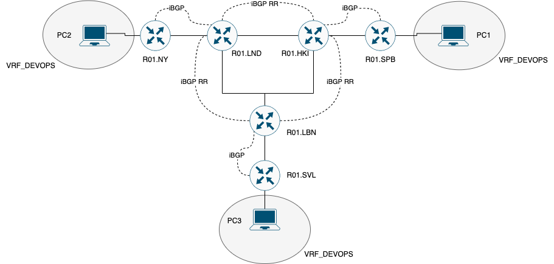

# Отчет по лабораторной работе №4

## Университет
* **University:** [ITMO University](https://itmo.ru/ru/)
* **Faculty:** [FICT](https://fict.itmo.ru)
* **Course:** [Introduction in routing](https://github.com/itmo-ict-faculty/introduction-in-routing)
* **Year:** 2024/2025
* **Group:** K3321
* **Author:** Babayev Ruslan Sagibovich
* **Lab:** Lab3
* **Date of create:** 18.12.2023
* **Date of finished:** 18.12.2023

## Задание

Вам необходимо сделать IP/MPLS сеть связи для "RogaIKopita Games" в ContainerLab. Необходимо создать все устройства указанные на схеме, и соединения между ними.

Первая часть:

* Настроить iBGP RR Cluster;
* Настроить VRF на 3 роутерах;
* Настроить RD и RT на 3 роутерах;
* Настроить IP адреса в VRF;
* Проверить связность между VRF;
* Настроить имена устройств, сменить логины и пароли.

Вторая часть:

* Разобрать VRF на 3 роутерах (или отвязать их от интерфейсов);
* Настроить VPLS на 3 роутерах;
* Настроить IP адресацию на PC1,2,3 в одной сети;
* Проверить связность.



## Описание работы

Для выполнения работы была арендована виртуальная машина в Cloud.ru. На неё были установлены `docker`, `make` и `containerlab`, а также склонирован репозиторий `hellt/vrnetlab` (в папку routeros был загружен файл chr-6.47.9.vmdk). C помощью `make docker-image` был собран соответствуший образ.

### Топология 

В рамках лабораторной работы реализована топология сети для компании "RogaIKopita Games" с использованием платформы ContainerLab. В сети используются маршрутизаторы Mikrotik RouterOS (`R01_spb`, `R01_hki`, `R01_lbn`, `R01_lnd`, `R01_svl`, `R01_ny`) и конечные устройства на базе Linux (`PC1`, `PC2`, `PC3`). Устройства соединены в соответствии с заданной схемой, обеспечивая связность между офисами компании и подключение хостов для проверки настроек. Для управления сетью используется подсеть `192.168.50.0/24`, с назначением уникальных IP-адресов для каждого маршрутизатора. Топология поддерживает реализацию IP/MPLS с VRF на первом этапе и VPLS на втором, что обеспечивает выполнение всех требований задания.

```
name: lab4-part1

topology:
    kinds:
        vr-mikrotik_ros:
            image: vrnetlab/vr-routeros:6.47.9
        linux:
            image: alpine:latest
    nodes:
        R01_spb:
            kind: vr-mikrotik_ros
            mgmt-ipv4: 192.168.50.11
            startup-config: configs/spb_1.rsc
        R01_hki:
            kind: vr-mikrotik_ros
            mgmt-ipv4: 192.168.50.12
            startup-config: configs/hki_1.rsc
        R01_lbn:
            kind: vr-mikrotik_ros
            mgmt-ipv4: 192.168.50.13
            startup-config: configs/lbn_1.rsc
        R01_svl:
            kind: vr-mikrotik_ros
            mgmt-ipv4: 192.168.50.14
            startup-config: configs/svl_1.rsc
        R01_lnd:
            kind: vr-mikrotik_ros
            mgmt-ipv4: 192.168.50.15
            startup-config: configs/lnd_1.rsc
        R01_ny:
            kind: vr-mikrotik_ros
            mgmt-ipv4: 192.168.50.16
            startup-config: configs/ny_1.rsc
        PC1:
            kind: linux
            binds:
              - ./configs:/configs/
        PC2:
            kind: linux
            binds:
              - ./configs:/configs/
        PC3:
            kind: linux
            binds:
              - ./configs:/configs/
    links:
        - endpoints: ["R01_spb:eth2", "R01_hki:eth4"]
        - endpoints: ["R01_spb:eth3", "PC1:eth2"]
        - endpoints: ["R01_hki:eth2", "R01_lbn:eth3"]
        - endpoints: ["R01_hki:eth3", "R01_lnd:eth2"]
        - endpoints: ["R01_lnd:eth3", "R01_lbn:eth2"]
        - endpoints: ["R01_lnd:eth4", "R01_ny:eth2"]
        - endpoints: ["R01_lbn:eth4", "R01_svl:eth2"]
        - endpoints: ["R01_ny:eth3", "PC2:eth2"]
        - endpoints: ["R01_svl:eth3", "PC3:eth2"]

mgmt:
    network: mgmt-net
    ipv4-subnet: 192.168.50.0/24
```

Ниже можно ознакомиться с графическим представлением этой схемы:


### Часть 1

#### Настройка маршрутизаторов

На маршрутизаторах, подключенных напрямую к конечным устройствам (например, R01_spb), настроены loopback-интерфейсы, BGP и OSPF для маршрутизации, а также DHCP-серверы для раздачи IP-адресов конечным устройствам. Для поддержки VRF настроены VRF-экспорт/импорт RT и RD, а также привязка интерфейсов и маршрутов. MPLS включен с настройкой LDP на соответствующих интерфейсах. BGP-пиры устанавливаются для обмена маршрутизационной информацией, включая VPNv4. OSPF обеспечивает связность в зоне backbone. Такая конфигурация позволяет маршрутизатору интегрироваться в IP/MPLS сеть и обслуживать трафик от конечных хостов.

Пример настройки `R01_spb`:
```
/interface bridge
add name=loopback0
/routing bgp instance
set default as=65500 router-id=172.16.4.2
/routing ospf instance
set [ find default=yes ] router-id=172.16.4.2
/ip pool
add name=dhcp_pool_spb ranges=172.16.7.2-172.16.7.254
/ip dhcp-server
add address-pool=dhcp_pool_spb disabled=no interface=ether4 name=dhcp_spb
/ip address
add address=172.16.4.2/32 interface=loopback0 network=172.16.4.2
add address=172.16.4.102/30 interface=ether3 network=172.16.4.100
add address=172.16.7.1/24 interface=ether4 network=172.16.7.0
/ip dhcp-server network
add address=172.16.7.0/24 gateway=172.16.7.1
/ip route vrf
add export-route-targets=65500:100 import-route-targets=65500:100 interfaces=ether4 route-distinguisher=65500:100 routing-mark=VRF_DEVOPS
/mpls ldp
set enabled=yes lsr-id=172.16.4.2 transport-address=172.16.4.2
/mpls ldp interface
add interface=ether3
add interface=ether4
/routing bgp instance vrf
add redistribute-connected=yes redistribute-ospf=yes routing-mark=VRF_DEVOPS
/routing bgp peer
add address-families=vpnv4 name=peer1 remote-address=172.16.1.2 remote-as=65500 update-source=loopback0
/routing ospf network
add area=backbone network=172.16.4.100/30
add area=backbone network=172.16.7.0/24
add area=backbone network=172.16.4.2/32
/system identity
set name=R01_SPB
```

Маршрутизаторы, входящие в iBGP RR-кластер (например, R01_hki), выполняют функции Route Reflector и настроены для обеспечения масштабируемости BGP-сессий. На каждом маршрутизаторе создаются loopback-интерфейсы и назначается уникальный Router ID. Конфигурируются OSPF и MPLS с активацией LDP на всех межузловых соединениях. Устанавливаются BGP-сессии с соседними устройствами, с указанием роли Route Reflector для необходимых пиров. Это обеспечивает эффективное распространение маршрутов между всеми узлами сети. Настройки OSPF включают подключение всех сетей маршрутизатора к зоне backbone, обеспечивая полную связность.

Пример настройки `R01_hki`:
```
/interface bridge
add name=loopback0
/routing bgp instance
set default as=65500 router-id=172.16.1.2
/routing ospf instance
set [ find default=yes ] router-id=172.16.1.2
/ip address
add address=172.16.1.2/32 interface=loopback0 network=172.16.1.2
add address=172.16.1.101/30 interface=ether3 network=172.16.1.100
add address=172.16.3.102/30 interface=ether4 network=172.16.3.100
add address=172.16.4.101/30 interface=ether5 network=172.16.4.100
/mpls ldp
set enabled=yes lsr-id=172.16.1.2 transport-address=172.16.1.2
/mpls ldp interface
add interface=ether3
add interface=ether4
add interface=ether5
/routing bgp peer
add address-families=vpnv4 name=peer1 remote-address=172.16.2.2 remote-as=65500 update-source=loopback0
add address-families=vpnv4 name=peer2 remote-address=172.16.3.2 remote-as=65500 route-reflect=yes update-source=loopback0
add address-families=vpnv4 name=peer3 remote-address=172.16.4.2 remote-as=65500 route-reflect=yes update-source=loopback0
/routing ospf network
add area=backbone network=172.16.1.100/30
add area=backbone network=172.16.3.100/30
add area=backbone network=172.16.4.100/30
add area=backbone network=172.16.1.2/32
/system identity
set name=R01_HKI
```

#### Настройка ПК

На каждом ПК был настроен DHCP-клиент для получения IP-адреса от соответствующего маршрутизатора, а также удалён дефолтный маршрут через сеть управления, чтобы трафик корректно шёл через рабочие интерфейсы сети. Настройки позволили ПК взаимодействовать с другими устройствами в сети.

Пример настройки PC:
```
#!/bin/sh
udhcpc -i eth2
ip route del default via 192.168.50.1 dev eth0
```

#### Пример работы

Пример использования команд `routing bgp vpnv4-rpute print` и `ping 172.16.x.1 routing-table=VRF_DEVOPS src-address 192.16.7.1` на `R01_spb`:


Для окончательной проверки работы сети использовалась команда `ping`, отправленная с `PC1` в офисе Санкт-Петербурга до остальных компьютеров в Севилье и Нью-Йорке. Обе проверки продемонстрировали успешное прохождение ICMP-пакетов, что подтверждает работоспособность туннеля и IP-соединения между двумя узлами:


### Часть 2

#### Настройка маршрутизаторов

На внешних маршрутизаторах (например, R01_spb) была выполнена отвязка VRF от интерфейсов и маршрутов. Для организации VPLS создан мост с отключенным протоколом STP, в который включён интерфейс, связанный с конечными устройствами. Настроен BGP-VPLS с указанием RT, RD и site-id, чтобы обеспечить туннелирование через MPLS. Добавлен IP-адрес из общей сети на интерфейс VPLS, а также переработаны DHCP-настройки: создан новый пул адресов, ориентированный на VPLS, и включен DHCP-сервер для раздачи адресов клиентам. Это позволяет устройствам в одной сети (10.10.66.0/24) подключаться через туннели VPLS.

Пример настройки `R01_spb` (только дополнительные команды):
```
/ip route vrf 
remove [find routing-mark=VRF_DEVOPS]
/routing bgp instance vrf 
remove [find routing-mark=VRF_DEVOPS]
/interface bridge
add name=vpls protocol-mode=none
/interface bridge port
add bridge=vpls interface=ether4
/interface vpls bgp-vpls
add bridge=vpls export-route-targets=1:2 import-route-targets=1:2 name=vpls route-distinguisher=1:2 site-id=4
/ip address
add address=10.10.66.40/24 interface=vpls network=10.10.66.0
/routing bgp peer
remove [find address-families=vpnv4]
add address-families=l2vpn name=peer1 remote-address=172.16.1.2 remote-as=65500 update-source=loopback0
/ip pool
remove [find name=dhcp_pool_spb]
add name=dhcp_pool_vpls ranges=10.10.66.2-10.10.66.39,10.10.66.41-10.10.66.49,10.10.66.51-10.10.66.59,10.10.66.61-10.10.66.254
/ip dhcp-server
remove [find name=dhcp_spb]
add address-pool=dhcp_pool_vpls disabled=no interface=vpls name=dhcp_vpls
/ip dhcp-server network
remove [find gateway=172.16.7.1]
add address=10.10.66.0/24 gateway=10.10.66.40
```

Маршрутизаторы iBGP-RR (например, R01_hki) были перенастроены для работы с VPLS, что включало удаление старых BGP-сессий и добавление новых с поддержкой l2vpn. Эти изменения обеспечивают распространение VPLS-маршрутов между узлами сети через Route Reflector. Настройка каждого пиринга выполняется с указанием loopback-адресов и соответствующих параметров для организации туннелей MPLS. Такая конфигурация позволяет поддерживать VPLS в масштабируемой BGP-инфраструктуре и обеспечивает связность между узлами.

Пример настройки `R01_hki` (только дополнительные команды):
```
/routing bgp peer
remove 0
remove 1
remove 2
add address-families=l2vpn name=peer1 remote-address=172.16.2.2 remote-as=65500 update-source=loopback0
add address-families=l2vpn name=peer2 remote-address=172.16.3.2 remote-as=65500 route-reflect=yes update-source=loopback0
add address-families=l2vpn name=peer3 remote-address=172.16.4.2 remote-as=65500 route-reflect=yes update-source=loopback0
```

#### Настройка ПК

Компьютеры были настроены также, как и в [первой части]().

#### Пример работы

Пример использования команд `ping 10.10.66.x0` на `R01_spb`:


Для окончательной проверки работы сети использовалась команда `ping`, отправленная с `PC1` в офисе Санкт-Петербурга до остальных компьютеров в Севилье и Нью-Йорке. Обе проверки продемонстрировали успешное прохождение ICMP-пакетов, что подтверждает работоспособность туннеля и IP-соединения между двумя узлами:


## Заключение

В ходе выполнения лабораторной работы была создана IP/MPLS сеть связи для компании "RogaIKopita Games" в среде ContainerLab. Все устройства, указанные на предоставленной схеме, были успешно созданы, а их соединения настроены согласно требованиям. Основное внимание было уделено реализации маршрутизации и туннелирования с использованием OSPF, MPLS, и BGP, а также построению двух различных моделей сетевой связности: на базе L3VPN и VPLS.

В первой части работы была выполнена настройка iBGP с использованием route reflector-кластера для оптимизации распространения маршрутов внутри автономной системы. На трех маршрутизаторах были созданы виртуальные маршрутизируемые форвардинговые таблицы (VRF), для которых настроены уникальные Route Distinguisher (RD) и Route Target (RT). IP-адресация внутри VRF организована таким образом, чтобы обеспечить маршрутизацию между VRF с помощью BGP и MPLS. После настройки была проверена связность, подтвердившая правильность маршрутизации внутри сети. Дополнительно для каждого устройства были заданы уникальные идентификаторы, обновлены имена, а также выполнена смена логинов и паролей для повышения безопасности.

Во второй части задачи требовалось преобразовать сеть, заменив VRF на VPLS, при этом сохранив общую топологию сети. На каждом маршрутизаторе были удалены настройки VRF и пересобрана конфигурация BGP с поддержкой l2vpn. Был создан новый мост для работы VPLS, куда подключены интерфейсы, связанные с конечными устройствами. IP-адресация была организована в рамках одной сети (10.10.66.0/24), обеспечивая работу устройств в едином сегменте с помощью туннелей VPLS. Для маршрутизатора `R01_SPB` был настроен DHCP-сервер, который раздавал адреса подключенным клиентам. Связность внутри сети была проверена и подтвердила успешное выполнение настроек.

Итогом работы стало построение масштабируемой IP/MPLS сети с гибкими возможностями для маршрутизации и туннелирования. Настройки и проверка сетевой инфраструктуры подтвердили готовность сети к эксплуатации в реальных условиях.
